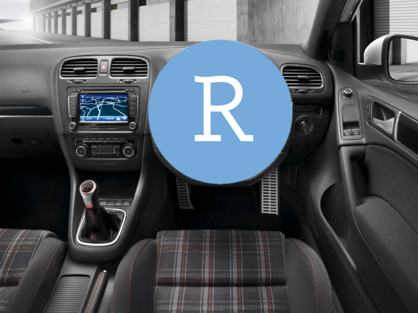

```{r setup, include=FALSE}
options(htmltools.dir.version = FALSE)
```

```{r xaringan-themer, include=FALSE, warning=FALSE}
library(xaringanthemer)
style_mono_accent(
  base_color = "#1F4257",
  # header_font_google = google_font("Josefin Sans"),
  # text_font_google   = google_font("Montserrat", "300", "300i"),
  # code_font_google   = google_font("Droid Mono")
)
```

class: title-slide, center, middle

# `r rmarkdown::metadata$title`

## `r rmarkdown::metadata$subtitle`

### &#183; `r rmarkdown::metadata$author` &#183;

### `r rmarkdown::metadata$institute`

#### `r rmarkdown::metadata$event` &#183; 2019

---

class: inverse, right, bottom


### Find me at...

.medium[
[`r icon::fa("github")` Alex Douglas](https://github.com/alexd106)  
[`r icon::fa("twitter")` Scedacity](https://twitter.com/scedacity)  
[`r icon::fa("paper-plane")` a.douglas@abdn.ac.uk](mailto:a.douglas@abdn.ac.uk)
]

---

class: center, middle

# Let's get started...


---

class: left, middle

# learning outcomes

.medium[
**this course (hopefully) will ...** 

- introduce you to using R and RStudio `r emo::ji("heavy_check_mark")`

- help your research become more robust and reproducible `r emo::ji("heavy_check_mark")`

- show you how to import your data `r emo::ji("heavy_check_mark")`

- show you how to summarise, visualise and analyse your data `r emo::ji("heavy_check_mark")` 

**this course (definitely) won't ...**

- teach you everything there is to know about R `r emo::ji("x")`

- make you feel completely comfortable with R `r emo::ji("x")`

]

---

background-image: url(images/Rcover_v2.png)
background-size: 200px
background-position: 90% 60%

class: left, middle

# course structure

.medium[

at the heart of this course is our open access  
[Introduction to R](https://alexd106.github.io/Rbook/) book

- introduction to R and RStudio environments

- perform basic operations in R

- importing exploring, wrangling and summarising data into R

- visualising data using base R and ggplot graphics

- introduce some simple statistics using R

- also other Chapters on programming in R,  
using R markdown and version control with Git and GitHub
]
---
background-image: url(images/intro2R.png)
background-size: 450px
background-position: 95% 55%

class: left, middle

# course structure

.medium[

and also our [intro2R](https://alexd106.github.io/intro2R/) website

- series of exercises (with solutions) to work through

- exercises cover material from each Chapter

- short how-to videos covering key R skills

- tutorials covering additional topics

- many links to other resources 

]
---

background-image: url(images/intro2R.png)
background-size: 450px
background-position: 95% 55%

class: left, middle

# suggested approach

.medium[

- work through material for each Chapter

- once you've finished a Chapter, test your  
understanding by completing the  
associated exercise

- don't peek at the solutions too quickly `r emo::ji("smile")`

- create an R script to document your code  
(preferably in an RStudio Project)

- use R's help pages and Google when you get stuck!

]
---

background-image: url(images/Rlogo.png)
background-size: 200px
background-position: 95% 95%

class: left, top

# What is R?

<br>
.medium[

- answer depends on who you ask and what they use R for

- environment for statistical computing, graphics and programming

- originally created by Ross Ihaka and Robert Gentleman (1996) 

- currently maintained by international R-core development team 

- many, many people also contribute to R and the wider  
R community

]

---

background-image: url(images/r-project.png)
background-size: 500px
background-position: 95% 50%

class: middle, left

.medium[

- more information can be found at  
https://www.r-project.com

- download R from the CRAN website  
https://cran.uk.r-project.org 

- see [here](https://alexd106.github.io/intro2R/howto.html) for a short video describing  
how to download and install R

]

---
class: left, middle

.center[
# why is R considered hard?
]

.pull-left[
.medium[

- high initial investment in time to learn R

- unfamiliar command line environment

- frustrating (and sometimes) inconsistent syntax

- analysis and figures can take longer (initially!)

- relatively steep learning curve

- it's not actually that hard, just unfamiliar
]
]

.pull-right[

]
---

background-image: url(https://i0.wp.com/r4stats.com/wp-content/uploads/2017/06/Fig_2d_ScholarlyImpact2016.png)
background-size: 450px
background-position: 95% 70%

class: middle, left

# why you should learn R

.medium[
-  it’s free and platform independent

- it’s the software of choice for many students,  
academics, industries and charities worldwide

- highly flexible and extensive

- encourages you think about your research  
questions, data and analyses

]
.footnote[
[Muenchen (2019)](http://r4stats.com/articles/popularity/)
]

---

background-image: url(images/repo2.png)
background-size: 1000px
background-position: 90% 90%

class: top, left

<br>
# why you should learn R

.medium[
-  it allows you to keep an exact and reproducible  
record of your analyses

- transparent

- other people* can reproduce your analysis

- easily share your code (GitHub)

- [open science](https://en.wikipedia.org/wiki/Open_science)
]

.footnote[
<sup>* including the future you!
]
---

background-image: url(images/plots.png)
background-size: 850px
background-position: 50% 95%

class: top, left

# why you should learn R

.medium[
-  excellent graphics capabilities
]

.footnote[
[ggplot2](https://github.com/tidyverse/ggplot2)
]

---

background-image: url(images/jobs.png)
background-size: 1000px
background-position: 95% 80%

class: top, left

# why you should learn R

.medium[
-  employability

- opportunity to get involved  
with a fantastic and supportive  
community
]
---
background-image: url(images/rconsole.png)
background-size: 850px
background-position: 50% 70%

.center[
# using R - GUI
]

---
class: center, middle

.pull-left[
.large[
R
]

]

.pull-right[
.large[
RStudio
]

]

---

background-image: url(images/Rstudio_2.png)
background-size: 1000px
background-position: 50% 95%

class: top, top
.center[
# using R - RStudio
]
---

class: left, top

<br>

# using R - objects


.medium[

- commands are typed in the editor and then sourced into the console  
at the > prompt

```{r, simple, prompt=TRUE, collapse=TRUE}
2 + 2
```

- R is object orientated. You can create variable and assign value(s) to them

```{r, simple2, prompt=TRUE, collapse=TRUE}
a <- 2 + 2
a
```
]

---

class: left, top

<br>

# using R - objects

.medium[

- once created, operations can be performed on variables 

```{r, simple3, prompt=TRUE, collapse=TRUE}
a <- 2 + 2
b <- 3 * 2

a + b
```

- this is very powerful and flexible 

- much of the functionality of R is enhanced by using variables called functions 

]
---
class: left, top

<br>

# using R - functions


.medium[
- functions contain a set of instructions that allow you to perform a specific task(s)

- you can use functions that are inbuilt in R

```{r, simple4, prompt=TRUE, collapse=TRUE}
numbers <- c(2, 3, 4, 5, 6)   # use the concatenate function
numbers

mean(numbers)                 # use mean function

var(numbers)                  # use variance function
```

- comments (#) are ignored by R
]

---

background-image: url(images/packages.png)
background-size: 800px
background-position: 50% 52%

class: left, top


# using R - functions


.medium[
- or you can install user contributed packages to increase versatility and power

- there are packages for almost anything

<br><br><br><br>
- install packages from [CRAN](https://cran.r-project.org/), [Bioconductor](https://www.bioconductor.org/) and [GitHub](https://github.com/)

- packages are easy to install in R
]

.footnote[
[RDocumentation (2019)](https://www.rdocumentation.org/trends)
]

---
class: left, top

<br>

# using R - functions


.medium[

- or write your own functions

- function to calculate standard error

<br>
```{r, simple5, prompt=TRUE, collapse=TRUE}
numbers <- c(2, 3, 4, 5, 6)    # use the concatenate function

se.fnc <- function(x){         # start function for se
 std.x <- sd(x)		             # calculate SD
 nos.x <- length(x)		         # calculate number obs
 se.x <- std.x/(sqrt(nos.x))   # calculate SE
 print(se.x)	
}

se.fnc(numbers)                # use your new function
```
]

---
class: left, top

<br>

# using R - syntax 

.medium[

- R is case sensitive `A` is not the same as `a` 

- commands are generally separated by a new line, but you can also use a `;` (rare)

- anything that follows the hash symbol (#) will be ignored by R. Use this to comment your code 

- a series of commands can be grouped using braces `{ }`

- write pretty code by following a [code style guide](https://google.github.io/styleguide/Rguide.html) 

]

---
background-image: url(images/Rstudio_3.png)
background-size: 500px
background-position: 50% 85%

class: left, top

# using R - plots 

.medium[

- by default plots are displayed in the 'Plots' pane in RStudio

- plots can be copied and pasted into your word processor of choice 

- better to export plots to an external file (jpeg, pdf, png etc)

]
---
class: left, top

<br>
# using R - help 

.medium[

- R has extensive help facilities

- from within R the main method of getting help is to use the `help()` function

```{r, simple6, prompt=TRUE, eval=FALSE, collapse=TRUE}
help("plot")    # open help file for the function plot
```

or equivalently

```{r, simple7, prompt=TRUE, eval=FALSE, collapse=TRUE}
?plot
```

- or to search the help files use `help.search("plot")` or `??plot`
]
---
class: left, top

<br>
# using R - help 

.medium[

- [Google it!](http://lmgtfy.com/?q=R+Error+in+library+there+is+no+package+called): Try Googling any error messages you get. It's not cheating and everyone does it! You'll be surprised how many other people have probably had the same problem and solved it.

- [Stack Overflow](http://stackoverflow.com/questions/tagged/r): There are many thousands of questions relevant to R on Stack Overflow

- [Here](https://stackoverflow.com/questions/tagged/r?sort=votes) are the most popular ones, ranked by vote. Make sure you search for similar questions before asking your own

- make sure you include a [reproducible example](http://stackoverflow.com/questions/5963269/how-to-make-a-great-r-reproducible-example/5963610#5963610) to get the most useful advice. A reproducible example is a minimal example that lets others who are trying to help you to see the error themselves.
]
---

class: left, top

# tips for learning R

.medium[

- use R often and use it regularly

- learning R is not a memory test, you have your R scripts

- you don’t need to know everything there is to know about R to use it productively

- staring at code for hours is not good for you. Walk away for a few minutes

- there are many ways to tackle a particular problem. See what others have done

- recognise that there will be times when things will get a little tough or frustrating. Try to accept these periods as part of the natural process of learning a new skill (we’ve all been there) and remember, the time and energy you invest now will be more than payed back in the not too distant future.
]
---
class: center, middle

# Let's get started...


---